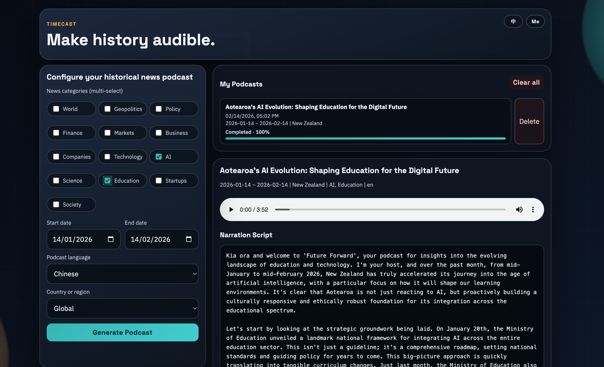
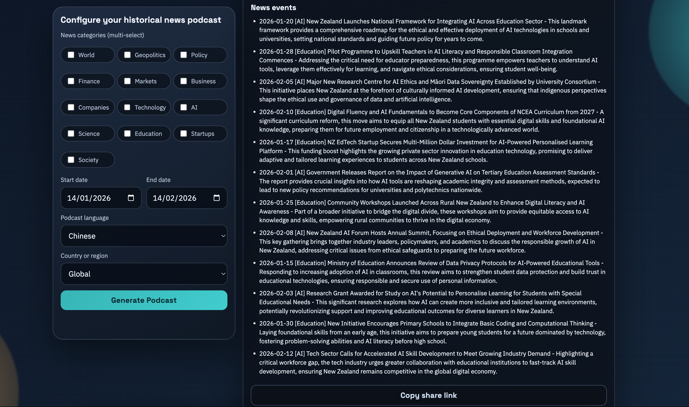
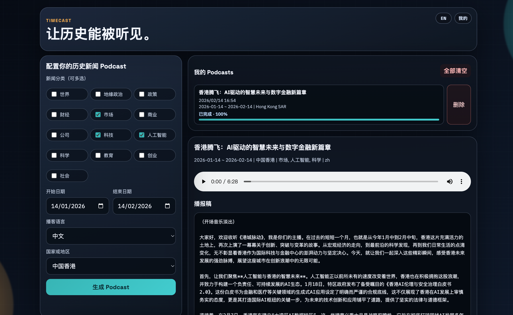
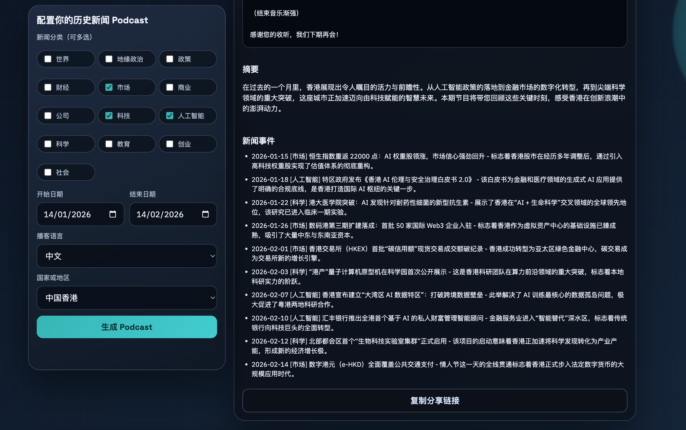

# Timecast

## Project Introduction

Timecast is a multilingual podcast generation platform powered by large language models. It automatically curates historical news based on specified categories, regions, and time ranges, and generates podcasts in multiple languages, enabling audiences around the world to “hear history” in their native language.

### UI Preview




## Features

- Google login
- Bilingual UI (Chinese / English)
- 8 podcast languages
- Multi-select news categories
- Date range + country/region selection
- AI-generated news events, script, and audio
- Player + script + summary + event list
- Public read-only share link
- Per-account podcast history
- Delete single history item / clear all history
- Generation progress bar and status

## Setup

1. Install dependencies

```bash
npm install
```

2. Create `.env` from `.env.example`

```bash
cp .env.example .env
```

3. Fill environment variables

```env
GOOGLE_CLIENT_ID=your_google_client_id
GEMINI_API_KEY=your_gemini_api_key
GEMINI_API_VERSION=v1
GEMINI_MODEL=gemini-2.5-flash
GEMINI_TTS_MODEL=gemini-2.5-flash-preview-tts
PORT=3000
```

4. Start the app

```bash
npm run dev
```

5. Open in browser

```text
http://localhost:3000
```

## Notes

- Use a valid Google OAuth client ID for login.
- Use valid Gemini model names for text and TTS.
- Generated metadata is stored in `data/podcasts.json`.
- Generated audio files are stored in `public/audio`.
